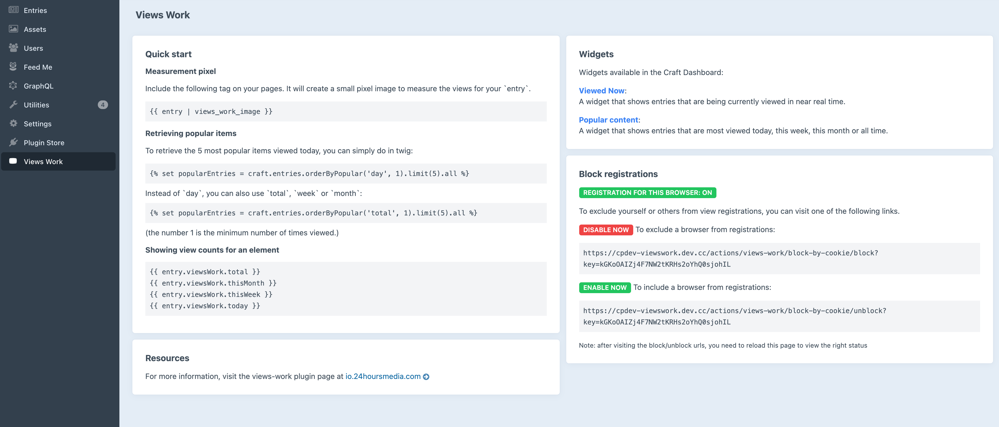
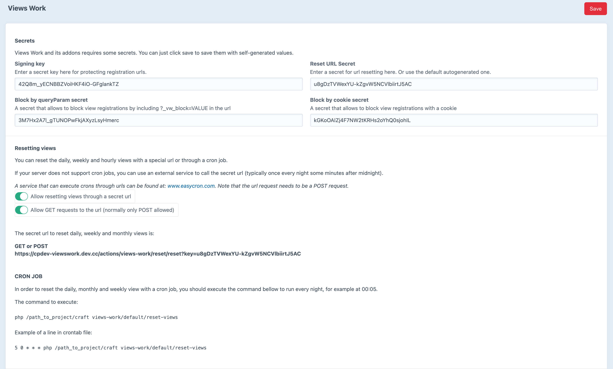
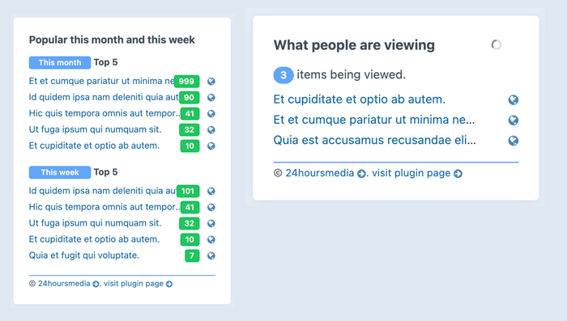

# Views Work plugin for Craft CMS >= 4.x

*ABANDONED* Unfortunately, we are not able to support this plugin.
Feel free to fork this code for your own purposes.
We changed the license to MIT license jan 5th 2024.

----

Views work 2.x is compatible with Craft CMS version 4.0 or higher.

---
Please view the full documentation at [io.24hoursmedia.com](https://io.24hoursmedia.com/views-work)!

----

* Track pageviews by day, week, month or grand total
* View popular entries in a widget
* Get popular entries and pageviews on the front-end in twig
* Uses a signed tracking image to register only real page views

## Usage

Show a beacon 1px x 1px image to register a pageview:

```
{# render the image for registration #}
{{ entry | views_work_image }}
```

Get popular items:
```
 %}

{# show this weeks views (also supported: today, thisMonth, total) #}
{{ entries.viewsWork.thisWeek }}

```

## Resetting view counters

Some view counters need to be periodically reset (such as the daily and
weekly counters). You can either do this with a special url
(provided in the control panel), or by setting up a cron job or using a
special url.

### Resetting views with a cron job

Execute this cron at an approprate time, i.e. once every day at 00:01 pm.  
It resets the daily, weekly and monthly view counters.  

The cron checks wether it is the first day of the week or month before resetting monthly or weekly views.

    ./craft views-work/default/reset-views


### Screenshots







----

Brought to you by [24hoursmedia](https://www.24hoursmedia.com)

Logo by https://www.iconfinder.com/ReactiveDoodlesApp

